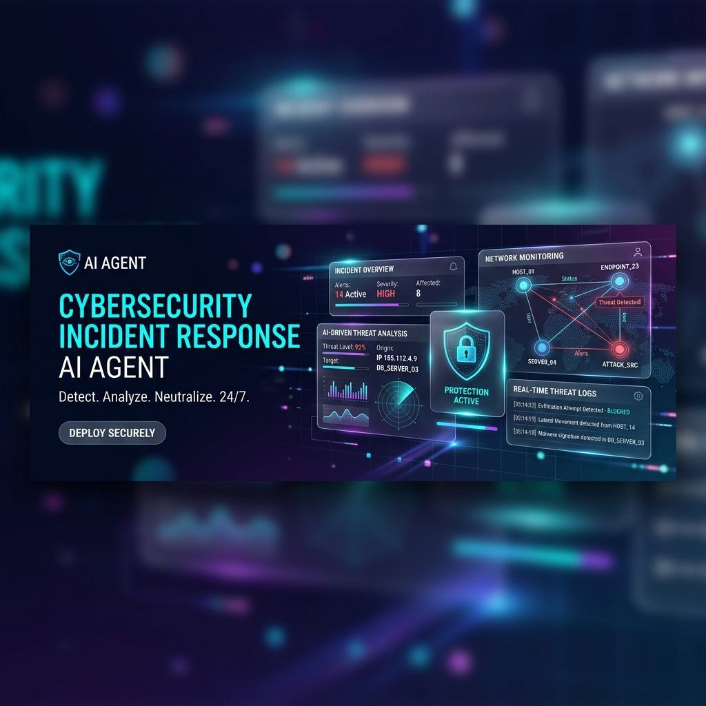
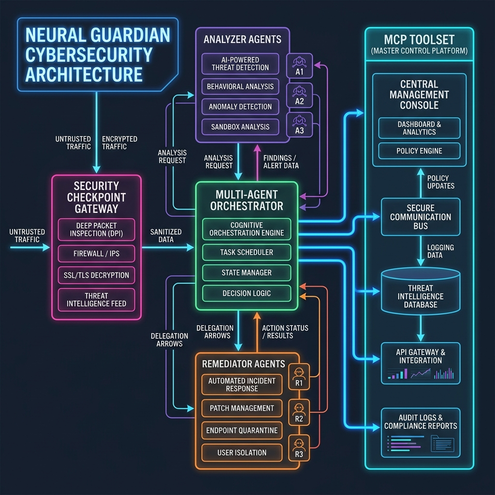
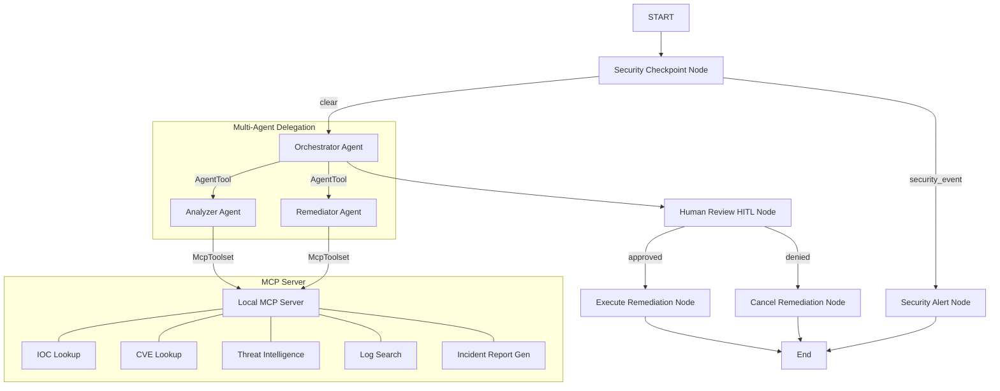

# Cybersecurity Incident Response Agent (`sec-incident-agent`)



An intelligent, multi-agent security orchestrator built on the **Google Agent Development Kit (ADK) 2.0** and **Model Context Protocol (MCP)** to triage security alerts, search log databases, enrich events with threat intelligence, draft remediation plans, and execute approved containment steps safely via Human-in-the-Loop gating.

This project is submitted as part of the **Kaggle Capstone Project**.

---

## 📖 Table of Contents
* [Architecture](#-architecture)
* [Core Features](#-core-features)
* [Prerequisites](#-prerequisites)
* [Installation & Setup](#-installation--setup)
* [Configuration](#-configuration)
* [How to Run](#-how-to-run)
* [Sample Test Cases](#-sample-test-cases)
* [Evaluation & Verification](#-evaluation--verification)
* [GitHub Setup & Deployment Instructions](#-github-setup--deployment-instructions)
* [Troubleshooting](#-troubleshooting)
* [Submission Writeup](#-submission-writeup)

---

## 🏗 Architecture

The system utilizes a multi-agent orchestration architecture where a central Lead Orchestrator delegates specialized sub-tasks to log analysis and remediation agents, gated by a secure input gateway and a Human-in-the-Loop (HITL) execution node.



### Workflow Graph (Mermaid Representation)



---

## ⚡ Core Features

1. **Secure Entry Checkpoint (`app/agent.py`)**
   * **OWASP-Inspired Sanitization**: Strips HTML tags and script elements from input strings.
   * **PII & Credential Redaction**: Automatically scrubs emails, passwords, bearer tokens, and credentials before they are processed by the LLM context.
   * **Prompt Injection Defense**: Filters signature keywords (e.g., "ignore previous instructions") and redirects malicious prompts to a security alert node.
   * **Audit Logging**: Outputs structured JSON logs for all gatekeeper checks.

2. **Specialized Agents (`app/agent.py`)**
   * **Lead Orchestrator**: Manages execution state and delegates tasks.
   * **Log Analyst Agent**: Searches logs and correlates indicators of compromise.
   * **Remediator Agent**: Outlines mitigation options and structures the markdown security report.

3. **Domain-Specific MCP Server (`app/mcp_server.py`)**
   * Exposes standard security interfaces via Stdio transport.
   * Connects agents to Mock Firewall/Authentication logs, CVE dictionaries, and IP reputation lookup engines.

4. **Human-in-the-Loop (HITL) Safeguard**
   * Pauses the workflow execution whenever a high-severity remediation (e.g. blocking an IP or locking an account) is requested.
   * Prompts the administrator for review, requiring explicit `yes` confirmation before execution.

---

## 📋 Prerequisites

* **Python**: `3.11` or `3.12` installed and configured.
* **Package Manager**: [uv](https://docs.astral.sh/uv/) (strongly recommended for fast, deterministic syncs).
* **Gemini API Key**: Set up via [Google AI Studio](https://aistudio.google.com/apikey).

---

## 🚀 Installation & Setup

1. **Clone the Repository**:
   ```bash
   git clone https://github.com/Kumar-jagadeesh/sec-incident-agent.git
   cd sec-incident-agent
   ```

2. **Synchronize Dependencies**:
   This project uses `uv` for package management. Sync your environment (this creates a `.venv` directory and copies package packages):
   ```bash
   make install
   ```

3. **Configure Environment Variables**:
   Create a local `.env` file from the template:
   ```bash
   cp .env.example .env
   ```
   Open the `.env` file and configure your API keys:
   ```env
   GOOGLE_API_KEY=AIzaSy...YourKeyHere...
   GEMINI_MODEL=gemini-2.5-flash
   ```

---

## ⚙ Configuration

Key environment variables in `.env`:

| Key | Description | Default |
|---|---|---|
| `GOOGLE_API_KEY` | Your Gemini API Key from Google AI Studio | *(Required)* |
| `GEMINI_MODEL` | The LLM model used by ADK agents | `gemini-2.5-flash` |
| `PORT` | API Server execution port | `8000` |

---

## 💻 How to Run

### 1. Interactive Developer Playground UI
Launch the ADK web playground interface to test conversation flows, audit logs, and Human-in-the-Loop review prompts in real-time.
```bash
make playground
```
*Accessible at [http://127.0.0.1:18081](http://127.0.0.1:18081).*

### 2. Production API Server
Run the FastAPI application locally to expose the Agent endpoints for other systems:
```bash
make run
```
*API docs will be available at [http://127.0.0.1:8000/docs](http://127.0.0.1:8000/docs).*

### 3. Quick Terminal Test
Run a single-turn prompt check using the `agents-cli`:
```bash
uv run agents-cli run "Can you check if there is any threat reputation for the IP address 8.8.8.8?"
```

---

## 🧪 Sample Test Cases

Test the three standard security scenarios directly in the Playground UI or CLI:

### Case 1: Low Severity (IOC Verification)
* **Prompt**: `Can you check if there is any threat reputation for the IP address 8.8.8.8?`
* **Flow**: Gatekeeper approves input -> Orchestrator sends to Analyzer -> Analyzer queries IP reputation -> Clean report returned -> Response given to user without requesting approvals.

### Case 2: Vulnerability Analysis & Data Redaction
* **Prompt**: `We received an alert regarding CVE-2021-44228. Can you search details for this vulnerability and give mitigation recommendations? Please send updates to ciso@company.com.`
* **Flow**: Security Checkpoint redacts `ciso@company.com` to `[REDACTED_EMAIL]`. Orchestrator calls Analyzer to check CVE details (Log4Shell). Remediator provides mitigation recommendations. The execution pauses for human approval.

### Case 3: Critical Containment (SSH Attack)
* **Prompt**: `Alert: We see suspicious activity. Search the security logs for failed login attempts, analyze the source IP 203.0.113.15, and generate the response.`
* **Flow**: Gatekeeper approves -> Analyzer searches auth logs -> Discovers SSH brute-force attempts from `203.0.113.15` -> Remediator drafts IP block action -> Execution pauses. The UI prompts: `Do you approve these remediation steps? (Reply 'yes' or 'no')`. Replying `yes` executes the containment rule.

---

## 📊 Evaluation & Verification

This project features a comprehensive evaluation suite to measure agent response quality, tool trajectories, and security guardrail compliance.

### Run Automated Unit/Integration Tests
Execute local pytest suites:
```bash
make test
```

### Run ADK Agent Evaluation Metrics
1. **Generate Evaluation Traces**:
   ```bash
   uv run agents-cli eval generate
   ```
2. **Grade Evaluation Performance**:
   ```bash
   uv run agents-cli eval grade
   ```
This evaluates the agent against pre-configured scenarios located in `tests/eval/datasets/`.

---

## 🐙 GitHub Setup & Deployment Instructions

To push this codebase to your own GitHub repository:

1. **Initialize Git**:
   ```bash
   git init
   git branch -M main
   ```
2. **Add Files**:
   ```bash
   git add .
   ```
   *(Ensure that your `.gitignore` correctly blocks the upload of your `.env` containing sensitive credentials).*
3. **Commit**:
   ```bash
   git commit -m "Initial commit: Cybersecurity Incident Response Agent"
   ```
4. **Link Repository & Push**:
   ```bash
   git remote add origin https://github.com/Kumar-jagadeesh/sec-incident-agent.git
   git push -u origin main
   ```

### Deploying to Google Cloud Run
To host this incident response agent on Google Cloud Run:
1. Enhance the project with Cloud Run deployment configurations:
   ```bash
   uv run agents-cli scaffold enhance . --deployment-target cloudrun
   ```
2. Deploy the service:
   ```bash
   uv run agents-cli deploy
   ```

---

## 🛠 Troubleshooting

1. **Error: `404 Model Not Found`**
   * *Solution*: Check that your `.env` contains a valid active model (e.g. `GEMINI_MODEL=gemini-2.5-flash`). Ensure your API key has access to that specific model in Google AI Studio.

2. **Error: `429 Resource Exhausted`**
   * *Solution*: The free tier of the Gemini API limits the number of requests per minute (RPM). Pause for 60 seconds and run the command again. If deploying in production, configure a paid Google Cloud billing account.

3. **Port Conflicts (`8000` or `18081` already in use)**
   * *Solution*: Stop any hanging background processes. On Windows (PowerShell):
     ```powershell
     Get-Process -Id (Get-NetTCPConnection -LocalPort 18081, 8000 -ErrorAction SilentlyContinue).OwningProcess | Stop-Process -Force
     ```

---

## 🎬 Demo Script

The spoken narration presentation script timed for a 3-4 minute walkthrough of the project, including visual cues and node-by-node architecture explanations, is available in [DEMO_SCRIPT.txt](file:///c:/Users/kumar/adk-workspace/sec-incident-agent/DEMO_SCRIPT.txt).

---

## 📝 Submission Writeup

The complete, judge-ready capstone project writeup is available in [SUBMISSION_WRITEUP.md](file:///c:/Users/kumar/adk-workspace/sec-incident-agent/SUBMISSION_WRITEUP.md). It details the problem statement, solution design, security layers, evaluation outcomes, and production impact of the Cybersecurity Incident Response Agent.
